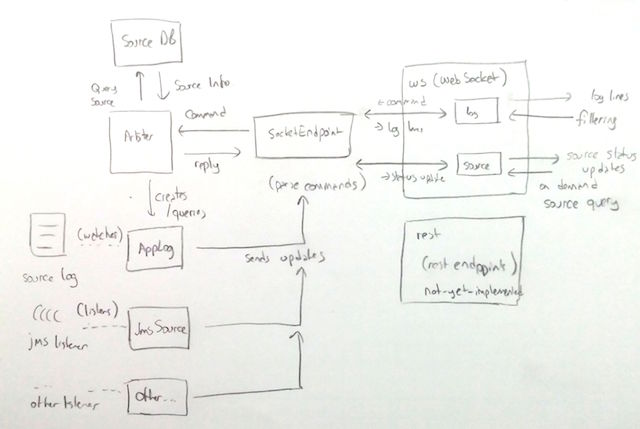

# Architecture Overview

There are 3 main logical components in Reactive Logs, all implemented in same Play! application: 

1. **Play! Endpoints:** Contains controllers for WebSocket, REST and Dynamic HTML producing methods. In the normal workflow, clients access Reactive Logs through the browser. Authentication, modifying / querying system settings, etc... will be performed by various REST endpoints. Also, browser will initiate a WebSocket connection to `/ws/source` endpoint to access configured & available log sources on system. User can select a source and subscribe to log updates via `/ws/log` endpoint.

2. **Core Actor System:** Bridges the gap between log data sources and Play! endpoints. Every command to `ws` endpoints is forwarded to `Arbiter` actor; who determines the course of action. `Arbiter` validates the source request from `SourceDB` and if the request is valid; links the relevant `SocketEndpoint` with the proper data source actor. 

3. **Data Sources:** This actors feed the data to the system. There are various types of planned Data sources; such as (but not limited to) log file readers, JMS service listeners, library specific listeners for `log4j`, `logback` or other logging libraries. Data sources get their configuration from `SourceDB` and can be created by `Arbiter` on demand. 

Here's a rudimentary diagram showing the communication between these components / actors:

